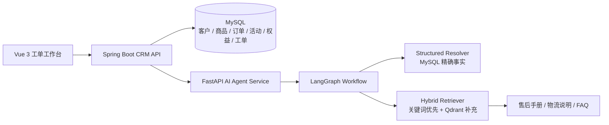

# AI 客户运营工单 Agent 系统

面向电商 CRM 场景的 AI 应用工程项目。系统保留客户、订单、商品、简化 RFM 分层和工单管理，并新增独立 FastAPI 服务，为客服提供有证据约束的处理建议和回复草稿。

项目目标不是让模型自由发挥，而是让活动、权益、商品和政策都有来源，让客服能够检查和修正结果。

## Architecture



MySQL 是结构化事实的唯一权威来源。Qdrant 只补充检索售后手册、物流说明、FAQ 和优惠券通用规则，不判断具体活动是否有效，也不判断客户是否有资格。

## Agent Workflow

1. `Intent Classifier`：识别商品咨询、投诉、售后、活动咨询或其他服务。
2. `Customer Strategy Profiler`：拆分价值等级和生命周期风险。
3. `Offer & Entitlement Resolver`：从 MySQL 查询可用活动和服务权益。
4. `Handbook Retriever`：关键词检索优先，Qdrant 中文语义检索补充。
5. `Reply Planner`：生成仅供客服查看的内部动作。
6. `Risk Checker`：检查虚构商品、无依据优惠和越权承诺。
7. `Final Composer`：生成客户回复草稿、证据充分度和执行轨迹。

前端允许客服人工修正意图并重新生成。AI 不直接发券、不执行退款、不承诺赔偿。

## Customer Strategy

本项目使用简化 RFM 规则演示，不宣称完整商业建模：

- `value_tier=high`：累计消费金额达到 `5000` 元，或订单数达到 `5` 单。
- `lifecycle_risk=active`：最近 `30` 天存在购买。
- `lifecycle_risk=silent`：超过 `30` 天未购买，且没有近期明显负面工单。
- `lifecycle_risk=churn_risk`：超过 `60` 天未购买，且最近 `30` 天存在投诉、退款或负面工单。

## Quick Start

### 1. Database

新建 MySQL 数据库 `customer_ai`。新安装依次导入基础 SQL、`promotion_campaign.sql`、`service_entitlement.sql` 和 `demo_seed_agent.sql`。已有数据库先执行：

```text
migration_agent_strategy.sql
promotion_campaign.sql
service_entitlement.sql
demo_seed_agent.sql
```

### 2. AI service

```bash
cd ai-service
python -m pip install -r requirements.txt
python ingest_handbook.py
uvicorn app:app --reload --port 8090
```

默认中文 Embedding 模型为 `BAAI/bge-small-zh-v1.5`。Qdrant 使用本地持久化目录；未完成导入或不可用时，系统自动回退到关键词检索。

### 3. CRM backend and frontend

```bash
mvn spring-boot:run
cd frontend
npm install
npm run dev
```

## Evaluation

```bash
cd ai-service
python -m unittest discover -s tests -v
python run_evaluation.py
```

离线报告位于 `ai-service/data/evaluation_report.json`。当前演示集包含 `30` 条场景，分别统计：

```text
intent_accuracy
evidence_recall_rate
grounded_output_rate
unauthorized_commitment_count
json_schema_pass_rate
fallback_success_rate
failed_cases
```

这些指标用于回归验证，不代表生产准确率。

## Current Boundaries

- 活动、权益和商城手册均为虚构演示数据。
- 人工复核仍是工单流程的一部分。
- 当前知识库规模较小，Qdrant 用于展示可扩展的语义检索能力，而不是性能刚需。
- 生产环境应使用独立 Qdrant 服务，并补充真实匿名化工单评测集。

