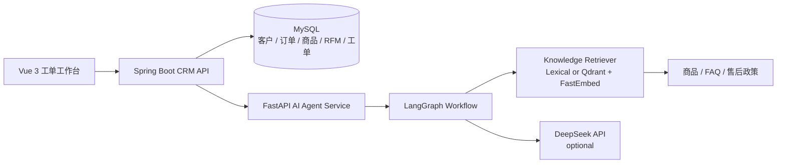

# AI 客户运营工单 Agent 系统

面向电商 CRM 场景的 AI 应用工程项目。系统保留传统 CRM 的客户、订单、商品、RFM 分层和工单管理能力，并新增独立 Python AI 服务，为客服工单提供意图识别、客户画像、知识检索、回复规划、风险检查和话术生成。

项目目标不是让模型自由发挥，而是让 AI 输出能够被业务数据约束、被客服人员检查、在服务异常时降级。

## Architecture



Spring Boot 负责业务数据和主流程；FastAPI 服务负责 AI 工作流。Python 服务不可用时，Java 会自动返回降级话术，不阻塞 CRM 工单处理。

## Agent Workflow

工单处理会依次经过以下节点：

1. `Intent Classifier`：识别商品咨询、投诉、售后、营销活动或通用服务。
2. `Customer Profiler`：聚合 RFM、订单和历史工单，识别高价值客户。
3. `Knowledge Retriever`：检索在售商品、FAQ、售后规则和服务政策。
4. `Reply Planner`：生成处理步骤。
5. `Risk Checker`：检查无商品证据、无政策依据、越权承诺等风险。
6. `Final Composer`：生成客服可编辑、可采纳的最终话术。

前端工单弹窗会展示意图、置信度、执行轨迹、召回证据、风险提示和回复草稿。

## Technology Stack

- CRM backend: Spring Boot 3.1, MyBatis-Plus, MySQL
- AI service: Python, FastAPI, LangGraph, Qdrant local mode, FastEmbed
- LLM: DeepSeek API, with deterministic template fallback
- Frontend: Vue 3, Vite, Axios, ECharts
- Evaluation: 20 work-order cases covering recommendation, complaint, after-sales, marketing, and fallback scenarios

The default retrieval backend is lightweight lexical retrieval for fast local startup. Set `AI_RETRIEVAL_BACKEND=qdrant` to enable Qdrant in-memory vector retrieval. Qdrant local mode follows the [official FastEmbed guide](https://qdrant.tech/documentation/fastembed/fastembed-semantic-search/).

## Quick Start

### 1. Database

Create a MySQL database named `customer_ai`, import the existing schema SQL files, then optionally import:

```text
demo_seed_agent.sql
```

Create a local `.env` from `.env.example` and configure MySQL and DeepSeek values.

### 2. AI service

```bash
cd ai-service
python -m pip install -r requirements.txt
uvicorn app:app --reload --port 8090
```

DeepSeek is optional for local demos. Without an API key, the service uses deterministic template generation.

### 3. CRM backend

```bash
mvn spring-boot:run
```

The backend starts on `http://localhost:8080`.

### 4. Frontend

```bash
cd frontend
npm install
npm run dev
```

Open the Vite URL and enter the work-order page.

## Evaluation

Run the AI workflow unit tests and the small offline evaluation set:

```bash
cd ai-service
python -m unittest discover tests
python run_evaluation.py
```

The generated report is stored in `ai-service/data/evaluation_report.json`. The current baseline passes `20/20` cases. This is a small regression set for engineering validation, not a production benchmark.

Run the Java and frontend checks:

```bash
mvn test
cd frontend
npm run build
```

## Important Files

```text
ai-service/agent_core.py                 # workflow nodes and fallback generation
ai-service/qdrant_retriever.py           # optional Qdrant local vector retrieval
ai-service/run_evaluation.py             # offline regression evaluation
src/main/.../AiAgentWorkflowService.java # Java-to-Python integration and degradation
frontend/src/views/InteractionView.vue   # trace, evidence, risk, and reply UI
demo_seed_agent.sql                      # demo work orders and products
```

## Current Boundaries

- The evaluation set is intentionally small and should be expanded with real anonymized cases.
- Qdrant local mode is suitable for demos; production deployment should use a persistent Qdrant instance.
- Human review remains part of the work-order flow. The generated reply is a draft, not an automatic outbound message.

